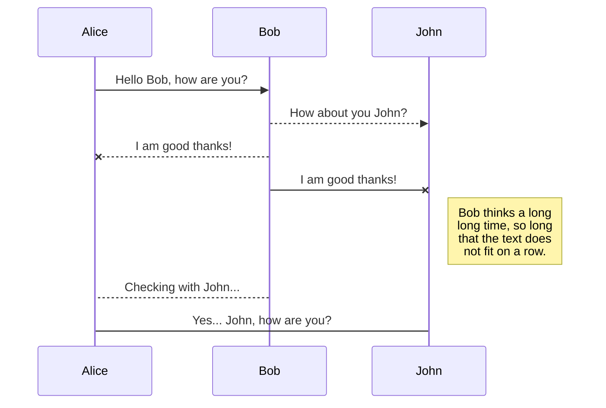
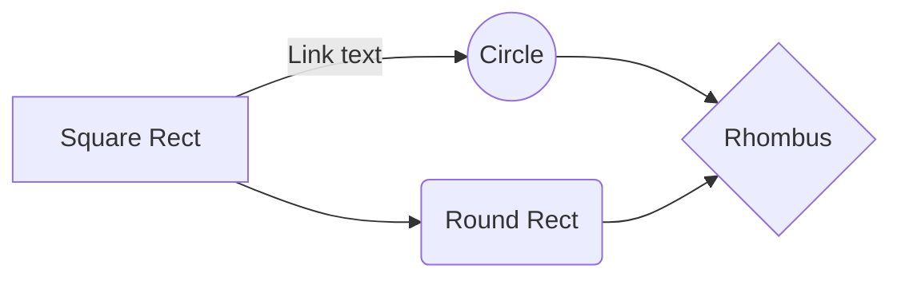

# RiskNarrative Spring Exercise

## Getting started

Add an environment variable named `X_API_KEY` containing your API key.

## Usage

Assuming a local URL on port 8080, POST a request to `http://localhost:8080/search?activeOnly=[true|false]`:

### By Company Name
*Example*:

    {
      "companyName" : "BBC"
    }
Returns 15 active or 20 active and inactive companies.

### By Company Number
*Example*:
If both `companyName` and `companyNumber` are provided, `companyNumber` only is used and `companyName` is effectively ignored. These two requires are effectively identical:
{
"companyName" : "BBC",
"companyNumber" : "06500244"
}

    {
      "companyNumber" : "06500244"
    }

## Assumptions

The brief stated that:

> "A request parameter **has to be added** to decide whether only active companies should be returned"

Therefore, the `activeOnly` parameter is obligatory and will not default to one or other option. Failure to include this will return a HTTP 400 error.

## Rename a file

You can rename the current file by clicking the file name in the navigation bar or by clicking the **Rename** button in the file explorer.

## Delete a file

You can delete the current file by clicking the **Remove** button in the file explorer. The file will be moved into the **Trash** folder and automatically deleted after 7 days of inactivity.

## Export a file

You can export the current file by clicking **Export to disk** in the menu. You can choose to export the file as plain Markdown, as HTML using a Handlebars template or as a PDF.

## UML diagrams

You can render UML diagrams using [Mermaid](https://mermaidjs.github.io/). For example, this will produce a sequence diagram:

And this will produce a flow chart:

