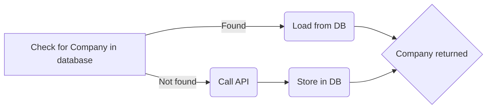

# RiskNarrative Spring Exercise

## Getting started

Add an environment variable named `X_API_KEY` containing your API key.

## Usage

Assuming a local URL on port 8080, POST a request to `http://localhost:8080/search?activeOnly=[true|false]`:

### By Company Name
*Example*:

    {
      "companyName" : "BBC"
    }
Returns 15 active or 20 active and inactive companies.

### By Company Number
*Example*:
If both `companyName` and `companyNumber` are provided, `companyNumber` only is used and `companyName` is effectively ignored. These two requests are therefore effectively identical:

    {
      "companyName" : "BBC",
      "companyNumber" : "06500244"
    }

    {
      "companyNumber" : "06500244"
    }
Any request made by `companyNumber` will return either zero or one items (assuming that `companyNumber` is a primary key, which was implied but not definitively stated).

### Database persistence
This project uses the H2 in-memory database using a `CrudRepository`. Any Company that has previously been found by an API call, whether by `companyName` and `companyNumber`, will be persisted in the database alongside its corresponding Address, Officers, and Officers' Address.

Making the following call to `http://localhost:8080/search?activeOnly=false` will store 20 Companies in the database:

    {
      "companyName" : "BBC"
    }
Making a second call, specifically by `companyName`, will initially check the database for the existence of a Company and attempt to return the Company, Officers, and Addresses from local storage. If the Company cannot be found in the database, an API call will be made and any results persisted for future use.

    {
      "companyNumber" : "06500244"
    }

The requirement was for persistence to be employed

> "if the endpoint is called with `companyNumber`"

It would have been straightforward to store the results of specific queries by `companyName`; however such a feature may also have resulted in a bloated database, since even minor changes to the search term could have resulted in a frequent duplicates. A more efficient possibility, where a one Company is linked to many cached search terms, might also have been possible but beyond the scope of this exercise.

As this is an in-memory database, it is cleared each time the application is restarted. However, it would be trivial to switch persistence to a disk-based store.

## Assumptions

The brief stated that:

> "A request parameter **has to be added** to decide whether only active companies should be returned"

Therefore, the `activeOnly` parameter is obligatory and will not default to one or other option. Failure to include this will return a HTTP 400 error.
